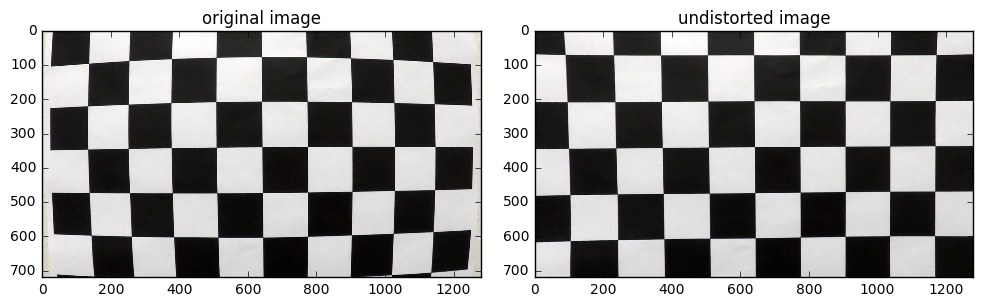
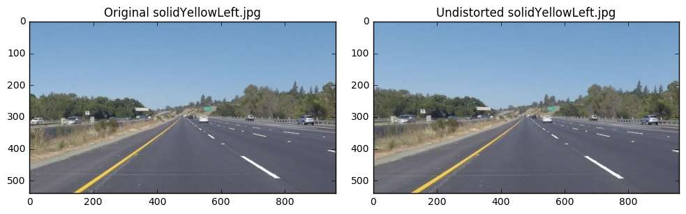
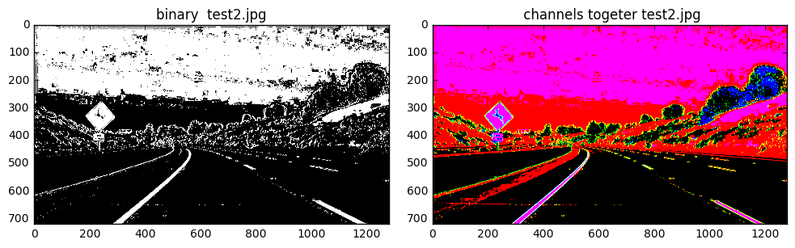
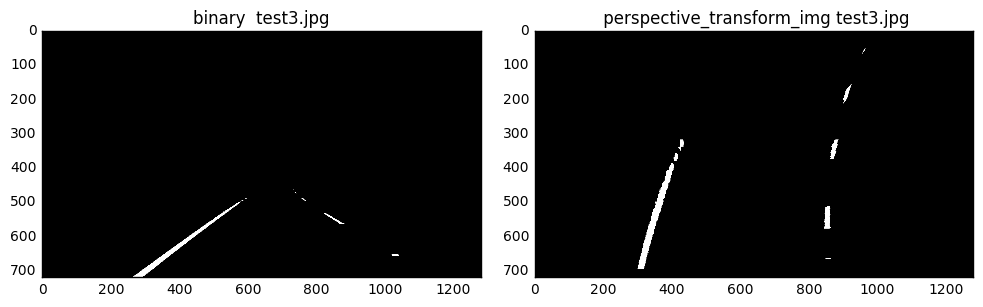
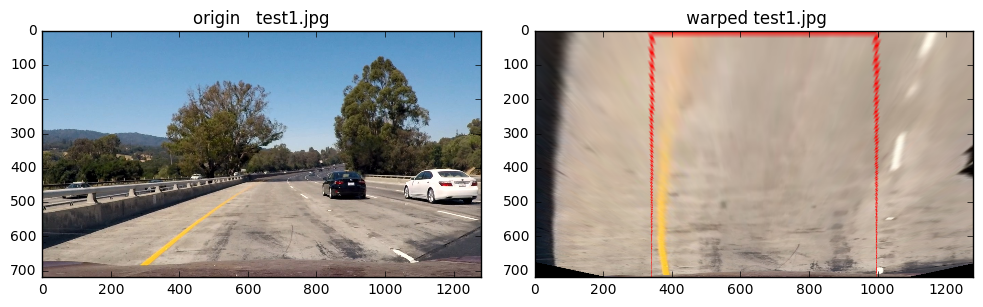
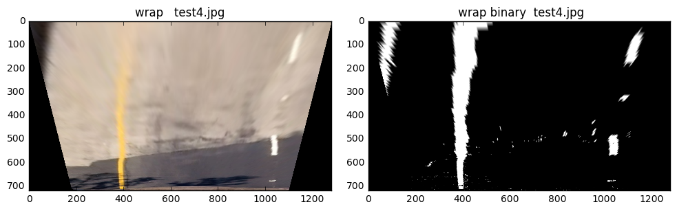
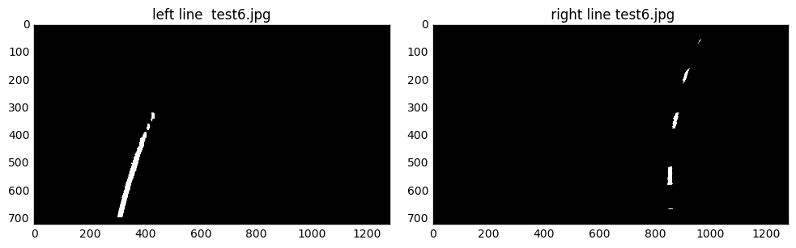
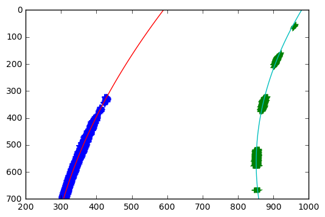
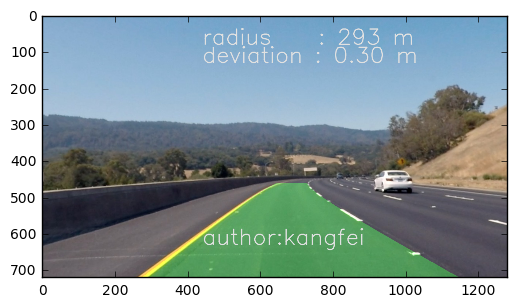

## Advanced Lane Finding

The goals / steps of this project are the following:  

* Compute the camera calibration matrix and distortion coefficients given a set of chessboard images.
* Apply the distortion correction to the raw image.  
* Use color transforms, gradients, etc., to create a thresholded binary image.
* Apply a perspective transform to rectify binary image ("birds-eye view"). 
* Detect lane pixels and fit to find lane boundary.
* Determine curvature of the lane and vehicle position with respect to center.
* Warp the detected lane boundaries back onto the original image.
* Output visual display of the lane boundaries and numerical estimation of lane curvature and vehicle position.

---

### Dependencies

This project requires **Python 3.5** and the following Python libraries installed:

- [Jupyter](http://jupyter.org/)
- [NumPy](http://www.numpy.org/)
- [SciPy](https://www.scipy.org/)
- [scikit-learn](http://scikit-learn.org/)
- [TensorFlow](http://tensorflow.org)
- [Matplotlib](http://matplotlib.org/)
- [Pandas](http://pandas.pydata.org/) 
- [kersar](http://kersar.org/) 

Run this command at the terminal prompt to install [OpenCV](http://opencv.org/). 

## step 
each to do 

### 1.Camera calibration. Compute the camera calibration matrix and distortion coefficients given a set of chessboard images.

The camera calibration process includes the use of 20 images of a chessboard taken from different angles and distances. This process throws a list of the 3D coordinates of the inner corners (object points) in the chessboard along with a list of the corresponding 2D coordinates (image points).
 

### 2.Apply a distortion correction to raw images.
Apply distortion correction to the original image based on the camera calibration matrix and the distortion factor
 

### 3.Use color transforms, gradients, etc., to create a thresholded binary image.
The gradient thresholding step is aimed to identify edges in the image. Since the lane lines are basically edges in the road, defining a proper thresholding with the corresponding parameters will help to define the lane lines.

 
  the objective is to identify pixels of a given color. To do so, ranges for the RGB channels are defined. 
   

### 4.Apply a perspective transform to rectify binary image ("birds-eye view").
The images of the road have a perspective which makes the parallel lines to meet in a vanishing point. Therefore, the images need to be transformed so the lane lines are displayed parallel to each other. To do so, four points in the original image are defined; these points form a trapezoid. Other four points are defined; these points form a rectangle. The transformation consists on mapping the former points to the latter ones, so the image is transformed accordingly, and the lane lines look parallel
 

### 5.Detect lane pixels and fit to find the lane boundary.
After separating the left and right lane line pixels, the lane boundary can be found by fitting to a second order polynomial. This fitting process can be done using the function
 
fit_lane_line(lr_binary_images)
where lr_binary_images is the binary image for the left and right lane lines. This function is based on the numpy function np.polyfit. This shows the fitted lane lines
 

### 6.Determine the curvature of the lane and vehicle position with respect to center.
The position relative to the center can be calculated by evaluating the fitting function at the bottom of the image and compared it to the center of the image
 

### 7. Warp the detected lane boundaries back onto the original image.

Once we detect the lane in the "bird-eye" view, we can wrap that back to the original image perspective.  The information of the lane curvature radius and vehicle position can be printed onto the image using

 

### 8.Pipeline (video)
This pipeline for a single image can be applied to the video the same way.

